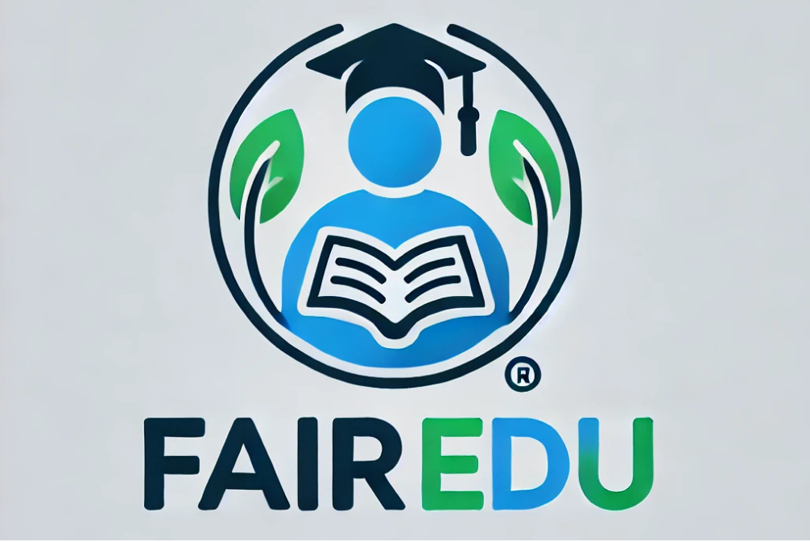
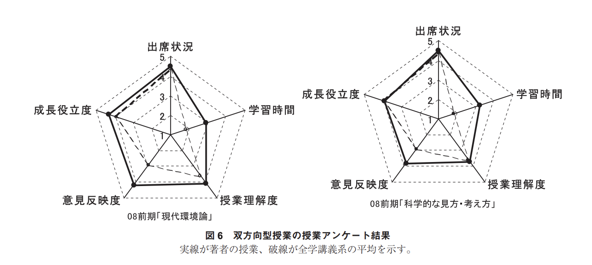
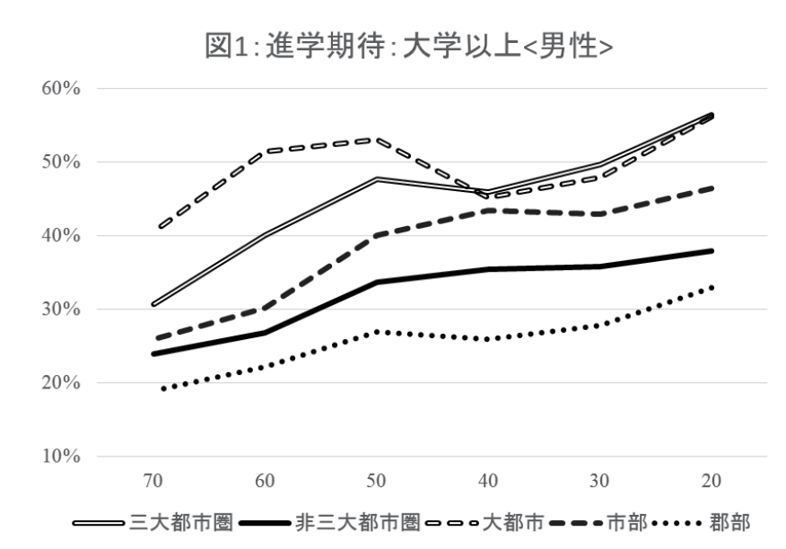

# FairEdu

## 製品概要
### 背景 (製品開発のきっかけ、課題等）
私たちは日本の教育について以下のような課題があると考えています。

### 顧客課題について
1. **一方的な教育が主流であること**
   
    日本の教育業界で300年以上主流である「先生が生徒に教える形式」やここ15年で流行りの「動画コンテンツ形式」は対話の機会が限られていて受動的であることが多く、生徒の理解に寄り添っているとは言い難いです。  
    
    また、一方的授業に比較して双方向型授業の方が学生の学習意欲を高め、授業外での学習時間を増加させることが次の資料でも示されています。  
    https://repository.kulib.kyoto-u.ac.jp/dspace/bitstream/2433/97919/1/01_kino.pdf
    (図6より引用)

1. **教育格差**
   
   教育格差には親の経済力と居住地という2つの軸があると考えています。
    1. **親の経済力**
   
        親の経済力によって質の高い教育のアクセスが制限される現状があります。

        日本の中高生の学習費用には年平均30万円かかっていますが (https://www.mext.go.jp/content/20221220-mxt_chousa01-000026656_1a.pdf )、この金額を払うには世帯年収が600万円必要と試算されています。現在の日本の世帯年収平均は500万円程度なので、親の経済力が原因で質の高い教育にアクセスが難しい層が存在していると言えます。

        また、親の世帯収入と子供のテストの正答率には正の相関がある事を示す研究も出ています。(https://www.ccn.yamanashi.ac.jp/~mikihikow/ueki%20dissertation%202020.pdf)

    2.  **都市部と地方の教育格差**
   
        老舗の高学力層向け学習塾(駿台予備校、河合塾、鉄緑会)などは顧客を大都市の進学校の生徒に絞っていて、地方の生徒が難関校に進学したいと思っても質の高い教育にアクセスするのが難しい現状です。

        実際に三大都市圏と非三大都市圏の間で大学進学率に明確な差が見られます。(https://www.l.u-tokyo.ac.jp/2015SSM-PJ/04_11.pdf)

    

### 解決策について

1. 能動的で双方向的な教育を提供する　　
    - 自分で能動的に進めていく新しい形式の教材
    - チャットbotサービスによって質問に対して即時24時間365日対応可能
    - 展望としてコーチング/ペースメイキングの要素も組み込み予定
2. 教育格差に対してのアプローチ
   - 非店舗型、生成AIを用いて省人化することによって安価に提供が可能
    - オンラインプラットフォームで提供することで居住地に関係なく同じ質の教育を提供
## 製品説明（具体的な製品の説明）
### 特徴
**生徒が自分の理解に沿って能動的に進めていく形式の教材**と**生成AIとの対話サービス**によって、「生徒の理解を第一にする安価な学習」というコンセプトで新しい形の中高生対象オンライン学習プラットフォームを開発しました。以下の特徴があります。
#### 1. 講義中の質問をチャットbotで対応し、自動で教材の該当セグメントに反映することでパーソナライズする
従来の受動的な教育の場合以下のような問題があると考えます、
  - 質問がそもそもしづらい雰囲気で、疑問があってもスルーしてしまいがちで学習がつまづく原因になりうる
  - 質問ができたとしても、会話のログが残らずに忘れてしまうリスクがある

チャットbotを使用することで、質問をする心理的なハードルが低くいつでも質問できます。さらに、質問の内容を教材の該当セグメントに自動で反映できることで、復習時に自分の抱いた疑問を再確認できるので学習効率が上がります。
#### 2. 教材への書き込み機能
教材の各セグメントをSVG形式で保持することで、教材の上から書き込めるようにした。iPadだけでなく学校でよく配布されるようなタブレットにも対応可能にするために、よく使われるPencilKitではなくFlutterのパッケージを改良して使用しています。
#### 3. セグメントごとの音声再生
教材の各セグメントに説明を補完するような音声を付与し、生徒のアテンションを維持しつつわかりやすい説明になるようにした。Whisperの読み上げ機能を利用している。
#### 4. 生成AIを用いた教材自体の生成
生徒の学習度に合わせた多様な教材を作成するために教材自体の生成にも取り組み、デモで用いた資料はほぼ生成AIで生成している。
### 解決出来ること
* 生徒との双方向学習が可能な教材の提供
* 自分の進捗を管理通知
* 低価格かつ何時どこでも使える学習アプリの提供
### 今後の展望
* 進捗管理機能の実装
* 確認テストの実装
* より広範囲な教材の作成
* 100人を目標にテストユーザーの確保
### 注力したこと（こだわり等）
* ただ、生成AIに丸投げするのではなく検索APIによる自動情報取得や批判、改善プロンプトを用いた自己改善ループの実装を用いて高品質な教材の自動作成を行いました。  
  
* 教材を分割することで、自らの進捗が可視化しやすくなり進捗管理をしやすくしました。
  
* チャットボットに質問した内容を自動的に教材へ反映することで、質問した内容を忘れることを防ぎました。
  
* ipadだけでなく他のタブレット端末でも使用できるように、一般的によく使われる書き込みツールであるpencil kit ではなく、scribbleというflutterのpackageを自分たちで改良して用いています。

## 既存サービスとの比較
- **ChatGPT**  
質問は教材の関連するセグメントに自動的に紐づけられて保存されるので、復習時に自分がした質問も確認することができ、学習効果が上がります。　　     
ChatGPTだと過去の履歴を辿るのは大変なのでこちらに分があると言えるでしょう。

- **スタディサプリをはじめとする安価な教育サブスクサービス**  
そのようなサービスは教師の授業動画コンテンツを再生する形になっており、一方的な教育といえます。  
我々は能動的で双方向的な教育を実現しようとしているのでここに違いがあります。

## 開発技術
### 活用した技術
#### API・データ
* OpenAI API
* Bingsearch API
* Voicevox

#### フレームワーク・ライブラリ・モジュール
- バックエンド：Go
- フロントエンド：Flutter
- LLM：Python(Langchain), OpenAI API
- データベース：PostgreSQL

#### デバイス
* タブレット端末

### 独自技術
#### ハッカソンで開発した独自機能・技術
- 生成AIを用いたプロンプト改善Agentの実装と自己改善ループ、補足情報検索の実装 
    * commit_id:56b7ddccacf26df61e5944c06f41319cb09441f8
    * ファイル名: ai/Generate_lesson_script.ipynb
- Fluitter パッケージのscribbleの改良  
    * レポジトリ: https://github.com/takumi8420/custom-scribble