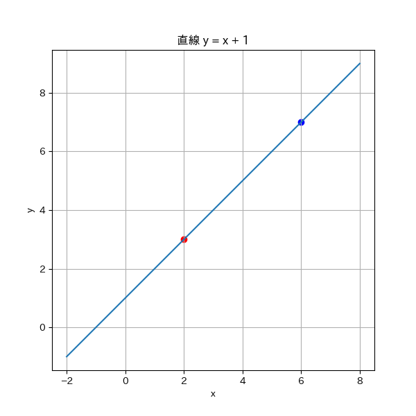
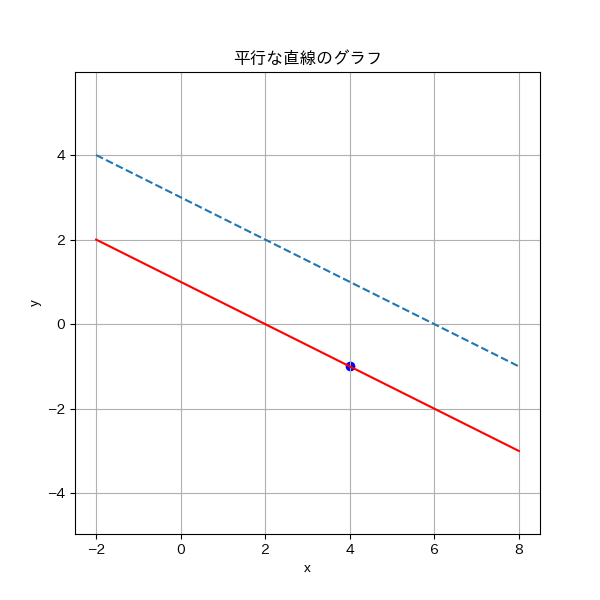
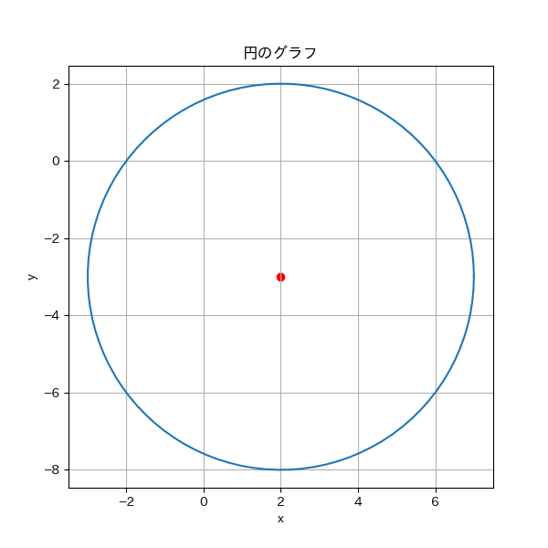
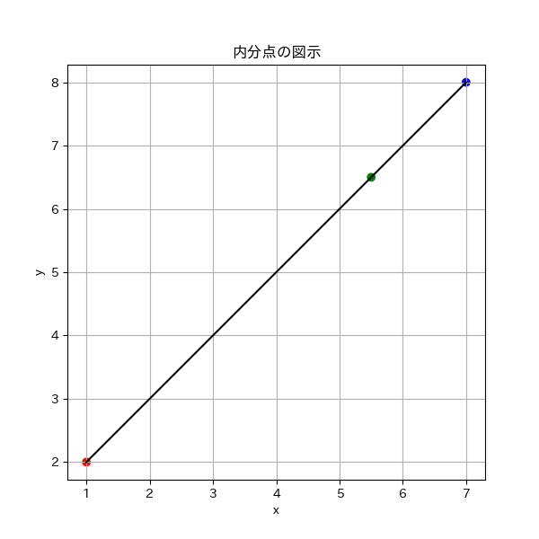

# 図形と方程式の講義テキスト

「図形と方程式」は高校数学でとても重要な単元です。ここでは、**図形を数式で表したり、数式から図形を描いたり**します。この分野を理解すると、数学全体の力がぐんと伸びます！

---

## 1. 基本的な考え方

「図形と方程式」では、**座標平面**（通常は  $x$-軸と  $y$-軸からなる二次元平面）上で図形を扱います。座標平面は、横の数直線（ $x$-軸）と縦の数直線（ $y$-軸）を使って、平面上の点の位置を表します。例えば、点  $(3, 2)$ は原点  $O$ から右に3、上に2進んだ場所です。

図形を方程式で表すことで、その性質を数式で解析できます。

また、座標平面上の図形は、**点の集合**として理解できます。
---

## 2. 直線の方程式

### 直線の方程式の形式

直線の方程式にはいくつかの形式があります。

1. **傾き・切片形式**

   $$
   y = mx + b
   $$

   -  $m$ は傾き、 $b$ は  $y$-切片（ $y$ 軸との交点）です。

2. **点・傾き形式**

   $$
   y - y_1 = m(x - x_1)
   $$

   -  $(x_1, y_1)$ は直線上の一点。

3. **一般形式**

   $$
   ax + by + c = 0
   $$

   -  $a$,  $b$,  $c$ は定数。

---

### 【例題1】

**点 A(2, 3) と点 B(6, 7) を通る直線の方程式を求めてください。**

---

#### 【解答】

1. **傾き  $m$ を求めます**

   $$
   m = \frac{y_2 - y_1}{x_2 - x_1} = \frac{7 - 3}{6 - 2} = \frac{4}{4} = 1
   $$

2. **点 A(2, 3) を通るので、点傾きの式に代入します**

   $$
   y - y_1 = m(x - x_1)
   $$

   に代入すると、

   $$
   y - 3 = 1(x - 2)
   $$

3. **方程式を整理します**

   $$
   y = x + 1
   $$

#### 【答え】

直線の方程式は  $y = x + 1$です。

---

### 【グラフの描画】

直線  $y = x + 1$ をグラフで表してみましょう。

#### 【グラフの説明】

- 赤い点が点 A(2, 3)、青い点が点 B(6, 7) です。
- 直線  $y = x + 1$ はこの2点を通っています。
---
### 【例題2】

**直線  $y = -\dfrac{1}{2}x + 3$ と平行で、点 (4, -1) を通る直線の方程式を求めてください。**

---

#### 【解答】

1. **平行な直線の傾きは同じなので、傾き  $m = -\dfrac{1}{2}$ です。**

2. **点 (4, -1) を通るので、点・傾き形式に代入します**

   $$
   y - y_1 = m(x - x_1)
   $$

   に代入すると、

   $$
   y - (-1) = -\dfrac{1}{2}(x - 4)
   $$

3. **方程式を整理します**

   $$
   y + 1 = -\dfrac{1}{2}x + 2
   $$

   $$
   y = -\dfrac{1}{2}x + 1
   $$

#### 【答え】

直線の方程式は ** $y = -\dfrac{1}{2}x + 1$** です。

---

### 【グラフの描画】

元の直線と求めた直線を同じグラフに描いてみましょう。

#### 【グラフの説明】

- 黒の破線が元の直線  $y = -\dfrac{1}{2}x + 3$。
- 赤い線が求めた直線  $y = -\dfrac{1}{2}x + 1$。
- 青い点が通るべき点 (4, -1)。
- 2つの直線は平行であることがわかります。

---

## 3. 円の方程式

次に、**円の方程式**について学びます。円は、特定の点（中心）から一定の距離（半径）にある点の集合です。

### 円の方程式の形式

1. **標準形**

   $$
   (x - h)^2 + (y - k)^2 = r^2
   $$

   -  $(h, k)$ は中心の座標。
   -  $r$ は半径。

2. **一般形**

   $$
   x^2 + y^2 + Dx + Ey + F = 0
   $$

   -  $D$,  $E$,  $F$ は定数。

---

### 【例題3】

**次の円の方程式を標準形に直し、中心と半径を求めてください。**

$$
x^2 + y^2 - 4x + 6y - 12 = 0
$$
---
#### 【解答】

1. **平方完成を行います**

   -  $x$ に関する項をまとめて平方完成：

     $$
     x^2 - 4x = (x - 2)^2 - 4
     $$

   -  $y$ に関する項をまとめて平方完成：

     $$
     y^2 + 6y = (y + 3)^2 - 9
     $$

2. **元の方程式に代入します**

   $$
   (x - 2)^2 - 4 + (y + 3)^2 - 9 - 12 = 0
   $$

3. **定数項をまとめます**

   $$
   (x - 2)^2 + (y + 3)^2 - 25 = 0
   $$

4. **両辺に 25 を加えます**

   $$
   (x - 2)^2 + (y + 3)^2 = 25
   $$

5. **中心と半径を求めます**

   - 中心： $(2, -3)$
   - 半径： $\sqrt{25} = 5$

#### 【答え】

- **標準形**： $(x - 2)^2 + (y + 3)^2 = 25$
- **中心**： $(2, -3)$
- **半径**：5

---

### 【グラフの描画】

この円をグラフで描いてみましょう。

#### 【グラフの説明】

- 円の中心は赤い点で示されています。
- 半径5の円が描かれています。

---

## 4. 内分点と外分点

**内分点**と**外分点**は、線分を特定の比で分ける点です。

### 内分点の公式

線分  $AB$ を  $m:n$ に内分する点  $P$ の座標：

$$
P\left( \frac{n x_1 + m x_2}{m + n},\ \frac{n y_1 + m y_2}{m + n} \right)
$$

---

### 【例題4】

**点 A(1, 2) と点 B(7, 8) を 3:1 に内分する点  $P$ の座標を求めてください。**

---

#### 【解答】

1. **公式に代入します**

   $$
   x = \frac{1 \times 1 + 3 \times 7}{3 + 1} = \frac{1 + 21}{4} = \frac{22}{4} = 5.5
   $$

   $$
   y = \frac{1 \times 2 + 3 \times 8}{3 + 1} = \frac{2 + 24}{4} = \frac{26}{4} = 6.5
   $$

#### 【答え】

点  $P$ の座標は ** $(5.5,\ 6.5)$** です。

---

### 【グラフの描画】

点 A、点 B、内分点 P をグラフで示してみましょう。

#### 【グラフの説明】

- 赤い点が点 A、青い点が点 B、緑の点が内分点 P です。
- 点 P は線分 AB を 3:1 に内分しています。

---

## 5. 2点間の距離と中点

### 2点間の距離

点  $A(x_1, y_1)$ と点  $B(x_2, y_2)$ の間の距離  $d$ は：

$$
d = \sqrt{(x_2 - x_1)^2 + (y_2 - y_1)^2}
$$

---

### 【例題5】

**点 A(3, 4) と点 B(-1, -2) の距離を求めてください。**

---

#### 【解答】

1. **公式に代入します**

   $$
   d = \sqrt{(-1 - 3)^2 + (-2 - 4)^2} = \sqrt{(-4)^2 + (-6)^2} = \sqrt{16 + 36} = \sqrt{52}
   $$

2. **平方根を簡単にします**

   $$
   \sqrt{52} = \sqrt{4 \times 13} = 2\sqrt{13}
   $$

#### 【答え】

距離は ** $2\sqrt{13}$** です。

---

### 線分の中点

線分  $AB$ の中点  $M$ の座標は：

$$
M\left( \frac{x_1 + x_2}{2},\ \frac{y_1 + y_2}{2} \right)
$$

---

### 【例題6】

**点 A(-2, 5) と点 B(6, -3) の中点  $M$ の座標を求めてください。**

---

#### 【解答】

1. **公式に代入します**

   $$
   x = \frac{-2 + 6}{2} = \frac{4}{2} = 2
   $$

   $$
   y = \frac{5 + (-3)}{2} = \frac{2}{2} = 1
   $$

#### 【答え】

中点  $M$ の座標は ** $(2,\ 1)$** です。

---

## 6. 発展的な問題

### 【発展例題1】

**放物線  $y = x^2 - 4x + 3$ 上に点  $P$ があり、その接線が点  $Q(5, 4)$ を通るとします。点  $P$ の座標を求めてください。**

---

#### 【解答】

1. **放物線上の一般点を設定します**

   点  $P(t,\ t^2 - 4t + 3)$

2. **放物線の接線の式を求めます**

   放物線の微分係数は：

   $$
   \frac{dy}{dx} = 2x - 4
   $$

   よって、点  $P$ における接線の傾きは：

   $$
   m = 2t - 4
   $$
---
3. **接線の方程式**

   $$
   y - (t^2 - 4t + 3) = m(x - t)
   $$

4. **接線が点  $Q(5, 4)$ を通るので、代入します**

   $$
   4 - (t^2 - 4t + 3) = (2t - 4)(5 - t)
   $$
---
5. **方程式を整理します**

   左辺：

   $$
   4 - t^2 + 4t - 3 = -t^2 + 4t + 1
   $$

   右辺：

   $$
   (2t - 4)(5 - t) = -2t^2 + 14t - 20
   $$
---
6. **方程式をまとめます**

   $$
   -t^2 + 4t + 1 = -2t^2 + 14t - 20
   $$

   両辺を整理すると、

   $$
   t^2 - 10t + 21 = 0
   $$
---
7. **解を求めます**

   二次方程式  $t^2 - 10t + 21 = 0$

   解の公式より、

   $$
   t = \frac{10 \pm \sqrt{(-10)^2 - 4 \times 1 \times 21}}{2} = \frac{10 \pm \sqrt{16}}{2}
   $$

   よって、

   -  $t = \frac{10 + 4}{2} = 7$
   -  $t = \frac{10 - 4}{2} = 3$
---
8. **点  $P$ の座標を求めます**

   -  $t = 7$ のとき：

     $$
     x = 7,\ y = 7^2 - 4 \times 7 + 3 = 49 - 28 + 3 = 24
     $$

     点  $P(7,\ 24)$

   -  $t = 3$ のとき：

     $$
     x = 3,\ y = 3^2 - 4 \times 3 + 3 = 9 - 12 + 3 = 0
     $$

     点  $P(3,\ 0)$

#### 【答え】

点  $P$ の座標は ** $(7,\ 24)$** または ** $(3,\ 0)$** です。

---

## まとめ

これらの発展的な問題は、「**軌跡と領域**」の概念を他の数学の分野と結びつけています。具体的には、以下のような分野との関連があります。

- **解析幾何学**：二次曲線・二次曲面の性質。
- **複素数平面**：複素数の絶対値と図形の関係。
- **不等式**：絶対値を含む不等式による領域の定義。
- **空間図形**：三次元空間における図形の方程式。

これらの問題に取り組むことで、軌跡と領域の理解が深まるだけでなく、他の数学的概念とのつながりも強化されます。

ぜひ、これらの問題に挑戦してみてください！

---